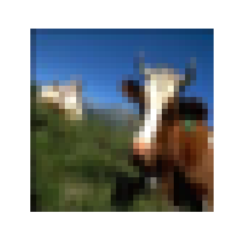
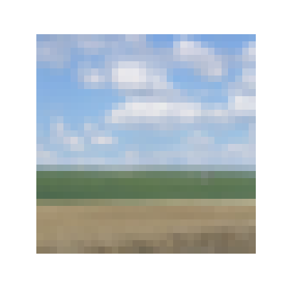
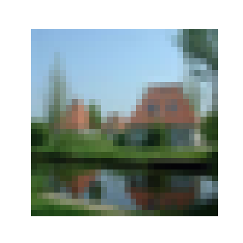
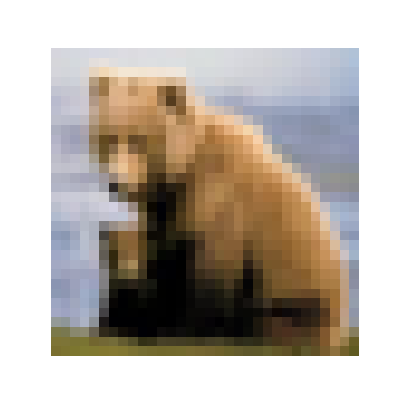
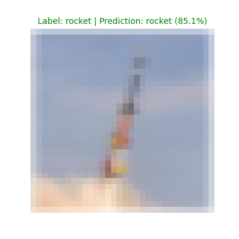
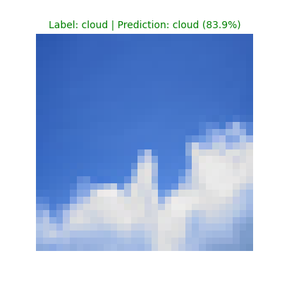
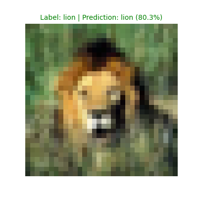
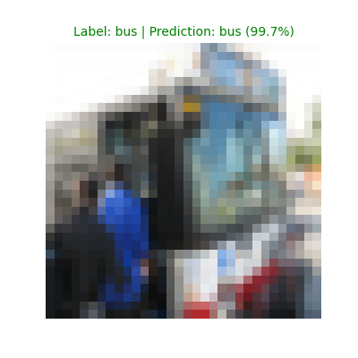

# CIFAR100-Image-Classification

A collection of modified CNN models implemented in PyTorch for the CIFAR-100 classification task. Models are adapted for
$32 \times 32$ inputs while preserving their core architectural logic.  
I'm using `PyTorch 2.10.0+cu128` in `Python 3.12.0`.

## Structure

```
├── data/
|   ├── cifar100/
|   ├── processed/
├── models/
|   ├── vgg16.py
|   ├── googlenet.py
|   ├── resnet18.py
|   └── ...
├── config.py
├── utils.py
├── prepare_data.py
├── dataset.py
├── train.py
├── predict.py
└── eval.py
```

## Requirements

```
matplotlib==3.10.8
numpy==2.4.4
Pillow==12.2.0
torch==2.10.0+cu128
torchvision==0.25.0+cu128
tqdm==4.67.3
```

## Dataset

The dataset comes from Kaggle website: [CIFAR-100](https://www.kaggle.com/datasets/melikechan/cifar100). It has a total
of 100 categories.  
The raw training set has 50,000 images (each category 500 images), the raw test set has 10,000 images (each category 100
images), each image is a $32 \times 32$ RGB image.

<br>
<p align="center">
    
    
    
    
    
    <br>
    <em><strong>CIFAR-100</strong></em>
</p>

## Data Preparation & Augmentation

#### <em>Splitting</em>:

To split the data, run the command -

```
python prepare_data.py
```

This will split the raw training data into 90% Training (45,000) and 10% Validation (5,000).

#### <em>Augmentation</em>:

I placed data augmentation in ```dataset.py```, including *random cropping*, *random horizontal flipping* and
*AutoAugment* (a reinforcement learning-based strategy that automatically searches for and applies the optimal
combination of data augmentation policies). These augmentations can enrich the diversity of the training data, and
improve model's robustness and generalization capability. Furthermore, data normalization is applied to stabilize the
training process.

## Train

To start training, run the command -

```
python train.py
```

I used a Cosine Annealing Schedule to adjust the learning rate during training -

```
scheduler = CosineAnnealingLR(optimizer, T_max=NUM_EPOCHS, eta_min=1e-6)
```

- **T_max**: Number of iterations for the learning rate to decrease to eta_min.
- **eta_min**: The minimum target learning rate.

The learning rate $\eta_t$ is adjusted according to the following formula:

$$
\eta_t = \eta_{min} + \frac{1}{2}(\eta_{max} - \eta_{min})\left(1 + \cos\left(\frac{T_{cur}}{T_{max}}\pi\right)\right)
$$

This strategy ensures a smooth transition from the initial learning rate to the minimum.

You can adjust hyperparameters in ```config.py``` according to your own hardware (It is recommended to train on a GPU).
I used an NVIDIA GeForce RTX 2080 Ti GPU (11GB VRAM).

<strong>*My trained weights:*</strong> [CIFAR-100](https://huggingface.co/LCZ-ctrl/cifar100-image-classification)

## Prediction

To test your trained model, run the command -

```
python predict.py
```

It randomly selects an image from the test set, and displays the image with its label and the model's predicition
results (green for correct, red for wrong).

<br>
<p align="center">
    
    
    
    
</p>

## Evaluation

To evaluate your trained model on the test set, run the command -

```
python eval.py
```

It will show the model's prediction accuracy on the test set.

| Model            | Params  | FLOPs   | Epochs | Time  | Top1 Accuracy | Top5 Accuracy |
|:-----------------|---------|---------|:-------|-------|:--------------|---------------|
| SqueezeNet       | 776.74K | 25.08M  | 150    | 0.47h | 68.64%        | 90.94%        |
| VGG-16           | 24.26M  | 408.85M | 150    | 0.49h | 74.09%        | 92.88%        |
| VGG-19           | 29.58M  | 522.23M | 150    | 0.49h | 73.40%        | 92.17%        |
| GoogLeNet        | 6.08M   | 483.24M | 150    | 0.65h | 78.01%        | 94.98%        |
| MobileNetv2      | 2.35M   | 94.67M  | 150    | 0.53h | 72.35%        | 93.40%        |
| MobileNetv3      | 4.33M   | 71.16M  | 150    | 0.51h | 73.63%        | 93.75%        |
| DenseNet-121     | 7.05M   | 908.19M | 150    | 1.40h | 80.47%        | 95.85%        |
| DenseNet-169     | 12.64M  | 1.08G   | 150    | 1.84h | 80.31%        | 95.77%        |
| ResNet-18        | 11.22M  | 557.94M | 150    | 0.48h | 77.55%        | 94.26%        |
| ResNet-34        | 21.33M  | 1.16G   | 150    | 0.71h | 78.27%        | 94.87%        |
| ResNet-50        | 23.71M  | 1.31G   | 150    | 1.15h | 79.10%        | 95.34%        |
| ResNet-101       | 42.70M  | 2.53G   | 150    | 1.92h | 80.33%        | 95.67%        |
| ResNeXt-50       | 23.18M  | 1.36G   | 150    | 1.39h | 81.21%        | 95.84%        |
| ResNeXt-101      | 42.33M  | 2.59G   | 150    | 2.29h | 81.72%        | 95.92%        |
| ShuffleNetv1     | 999.87K | 45.36M  | 150    | 1.27h | 71.74%        | 93.02%        |
| ShuffleNetv2     | 1.36M   | 47.36M  | 150    | 0.46h | 72.77%        | 93.04%        |
| WideResNet-40-4  | 8.97M   | 1.30G   | 150    | 0.84h | 80.07%        | 95.65%        |
| WideResNet-28-10 | 36.54M  | 5.25G   | 150    | 2.46h | 81.33%        | 95.89%        |
